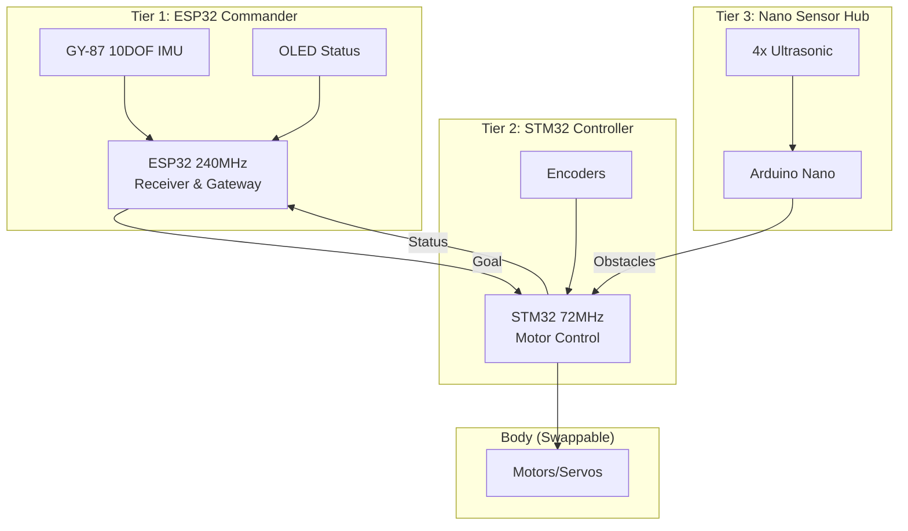

# Ghost Micro v4.0 - 3-Tier Hierarchical Architecture

## 🎯 System Overview



---

## 📊 Module Placement

### ESP32 Brain (Commander)
| Module | Interface | Pins | Purpose |
|:-------|:----------|:-----|:--------|
| **GY-87 IMU** | I2C | GPIO21/22 | Heading & Tilt (MPU6050+HMC5883L) |
| **OLED Display** | I2C | Shared with IMU | Status Display |
| **STM32 Link** | UART1 | GPIO1/3 | Command/Status |

### STM32 Controller (Motor Control)
| Module | Interface | Pins | Purpose |
|:-------|:----------|:-----|:--------|
| **Encoder Left** | Timer2 | PA0/PA1 | Speed Feedback |
| **Encoder Right** | Timer3 | PA6/PA7 | Speed Feedback |
| **Buzzer** | PWM | PB0 | Audio Feedback |
| **LED** | GPIO | PC13 | Status Indicator |
| **ESP32 Link** | USART3 | PB10/PB11 | Receive Goals |
| **Nano Link** | USART2 | PA2/PA3 | Motor Commands |

### Nano Sensor Hub (Peripherals)
| Module | Interface | Pins | Purpose |
|:-------|:----------|:-----|:--------|
| **Ultrasonic Front** | Digital | D2/D3 | Obstacle Detection |
| **Ultrasonic Left** | Digital | D4/D5 | Side Clearance |
| **Ultrasonic Right** | Digital | D6/D7 | Side Clearance |
| **Ultrasonic Rear** | Digital | D8/D9 | Reverse Safety |
| **STM32 Link** | UART | D0/D1 | Report Obstacles |

---

## 🔗 Communication Protocols

### ESP32 → STM32: Goal Commands
```cpp
struct GoalCommand {
    uint8_t header;      // 0xAA
    uint8_t mode;        // 0x01=Manual, 0x02=Heading, 0x03=Waypoint
    int16_t heading;     // Target heading (0-359°)
    int8_t speed;        // Target speed (-100 to +100)
    uint8_t checksum;
};
```

### STM32 → ESP32: Status Reports
```cpp
struct StatusReport {
    uint8_t header;      // 0xBB
    int16_t current_heading;
    int16_t left_rpm;
    int16_t right_rpm;
    uint8_t obstacle_flags;  // Bit: Front/Left/Right/Rear
    uint8_t checksum;
};
```

### Nano → STM32: Obstacle Map
```cpp
struct ObstacleMap {
    uint8_t header;      // 0xCC
    uint16_t front_cm;   // 0-400cm
    uint16_t left_cm;
    uint16_t right_cm;
    uint16_t rear_cm;
    uint8_t checksum;
};
```

---

## 🧩 Modular Body Design

### Current: 4WD Rover
- **Actuators:** 4x TT Motors + L298N
- **Sensors:** 4x Ultrasonic + 2x Encoders

### Future: Hexapod
- **Actuators:** 18x Servos (3 per leg)
- **Sensors:** 6x Ultrasonic (one per leg)

### Future: Quadcopter
- **Actuators:** 4x Brushless ESCs
- **Sensors:** Barometer + Gyro

**Key:** ESP32 stays the same! Only STM32 body code changes.

---

## 📦 Required Components (New)

### For ESP32 Tier
- [ ] GY-87 IMU (I2C) - Alternative to BNO055
- [ ] OLED Display (I2C)

### For STM32 Tier
- [ ] 2x Rotary Encoders (for wheels)

### For Nano Tier
- [ ] 4x HC-SR04 Ultrasonic Sensors

---

## 🚀 Implementation Phases

1. **Phase 2:** Integrate GY-87 IMU to ESP32
2. **Phase 3:** Add Encoders to STM32 + PID control
3. **Phase 4:** Add Ultrasonics to Nano
4. **Phase 5:** Integration testing

**Status:** Architecture designed ✅  
**Next:** Hardware integration
