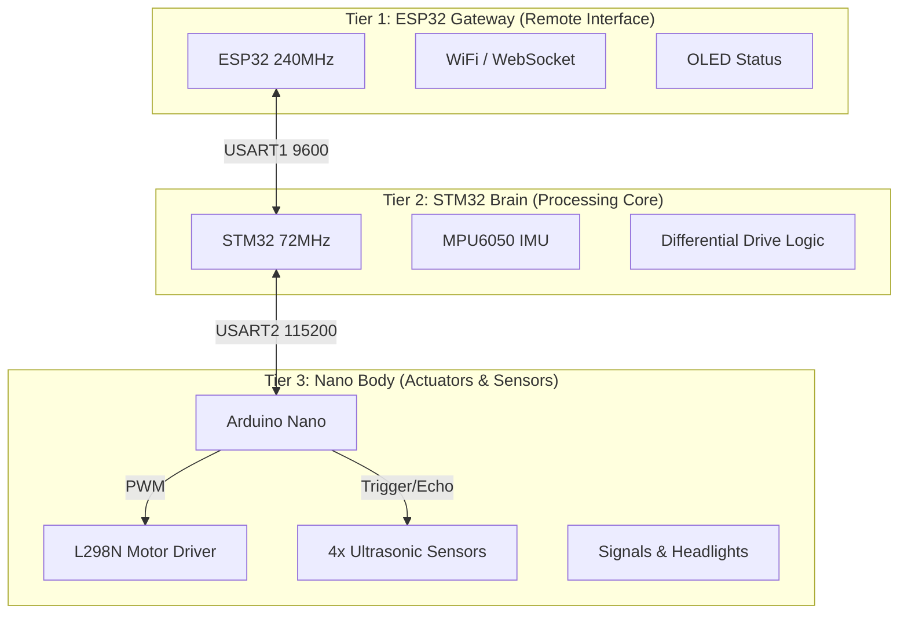

# Ghost Micro v4.5 - Definitive 3-Tier Architecture

## 🎯 System Overview

---

## 📊 Module Placement (Final V4.5)

### ESP32 Gateway
| Module | Interface | Pins | Purpose |
|:-------|:----------|:-----|:--------|
| **Link to STM32** | Serial1 | RX:34, TX:27 | **CRITICAL:** Safe pins for flash stability |
| **OLED 128x64** | I2C | SDA:21, SCL:22 | Local Status Display |
| **WiFi Link** | Wireless | - | Dashboard Connectivity |

### STM32 Brain
| Module | Interface | Pins | Purpose |
|:-------|:----------|:-----|:--------|
| **Link to ESP32** | USART3 | PB10, PB11 | Gateway Communication |
| **MPU6050 IMU** | I2C | PB6, PB7 | Orientation & Self-Healing |
| **Link to Nano** | USART2 | PA2, PA3 | Body Control & Sensor Hub |

### Nano Body Hub
| Module | Interface | Pins | Purpose |
|:-------|:----------|:-----|:--------|
| **L298N Drive** | Digital/PWM| D5-D10 | 4-Wheel Drive Control |
| **Ultrasonic F** | Digital | D2, D3 | Obstacle Detection |
| **Signals L/R** | Analog | A0, A1 | Indicators (Shifted for US) |
| **Headlight** | Digital | A3 | Night Vision |

---

## 🔗 Protocols V4.5

### STM32 → ESP32 (Telemetry)
- **Header:** `0xBB 0xCC`
- **Payload:** `struct Telemetry` (Acc, Gyro, Temp, Seq)
- **Security:** XOR Checksum

### ESP32 → STM32 (Commands)
- **Header:** `0xAA`
- **Payload:** `struct Payload` (Speed, Heading, Lights)

### STM32 → Nano (Actuators)
- **Header:** `0xFF`
- **Format:** `[0xFF][L][R][Lights][Audio]`

1. **Phase 2:** Integrate GY-87 IMU to ESP32
2. **Phase 3:** Add Encoders to STM32 + PID control
3. **Phase 4:** Add Ultrasonics to Nano
4. **Phase 5:** Integration testing

**Status:** Architecture designed ✅  
**Next:** Hardware integration
