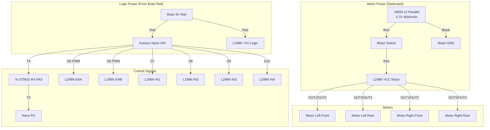

# Ghost Micro - Bottom Layer Wiring (Drive System)

## Overview
The Bottom Layer handles all motor control for the 4WD chassis. It uses a dedicated power system to prevent motor noise from affecting the Brain.

## Components
- **Controller:** Arduino Nano (5V)
- **Motor Driver:** L298N Dual H-Bridge
- **Motors:** 4x TT Geared Motors (Yellow)
- **Power:** 2x 18650 Li-Ion (3.7V Parallel) → **Dedicated Motor Battery**

---

## Wiring Diagram



### Physical Wiring Reference


---

## Pin Mapping

### Arduino Nano Pinout Reference


### Arduino Nano → L298N
| Nano Pin | L298N Pin | Function |
|:---------|:----------|:---------|
| D5 (PWM) | ENA | Left Motors Speed |
| D6 (PWM) | ENB | Right Motors Speed |
| D7 | IN1 | Left Motor Direction A |
| D8 | IN2 | Left Motor Direction B |
| D9 | IN3 | Right Motor Direction A |
| D10 | IN4 | Right Motor Direction B |
| 5V | +5V (Logic) | Logic Power |
| GND | GND | Common Ground |

### Arduino Nano ↔ STM32 Brain
| Nano Pin | STM32 Pin | Function |
|:---------|:----------|:---------|
| TX (D1) | PA3 (RX2) | Send Status to Brain |
| RX (D0) | PA2 (TX2) | Receive Commands from Brain |

> [!WARNING]
> **Programming Nano:** When uploading code via USB, you **must disconnect TX/RX wires** to avoid conflicts with the USB serial port.

#### 🔧 Recommended Solutions (Keep Maximum Speed)

**Option 1: Use ISP Programming (Best for Production)**
- Use **USBasp** or **Arduino as ISP** to program Nano via ICSP header
- **No need to disconnect TX/RX wires!**
- Keeps HardwareSerial (D0/D1) for maximum speed (115200 baud stable)

**Option 2: Add Jumpers (Quick Development)**
- Install **2-pin jumpers** on TX/RX lines
- Remove jumpers during upload, reconnect after
- Faster than unplugging individual wires

> [!NOTE]
> We use **HardwareSerial (D0/D1)** for STM32 communication because:
> - **Faster:** Hardware UART is 10x more reliable than SoftwareSerial at 115200 baud
> - **CPU Efficient:** No software overhead, uses dedicated UART hardware
> - **No Data Loss:** Hardware buffer prevents missed bytes during motor control

### L298N → Motors (4WD Configuration)
| L298N Output | Motor Position |
|:-------------|:---------------|
| OUT1/OUT2 | Left Side (Front + Rear Parallel) |
| OUT3/OUT4 | Right Side (Front + Rear Parallel) |

> [!NOTE]
> **4WD Wiring:** Connect Front and Rear motors on each side in **Parallel** to the same L298N output. This allows one L298N to control all 4 motors (2 channels = 2 sides).

---

## Power System Details

### Motor Battery (Dedicated)
- **Type:** 2x 18650 Li-Ion in Parallel
- **Voltage:** 3.7V nominal (3.0V - 4.2V range)
- **Capacity:** ~4000-6000mAh (depends on cells)
- **Connection:** B+ and B- to L298N Motor Power Input

### Logic Power (Shared from Brain)
- **Source:** Brain's H969-U 5V Rail
- **Consumers:** Nano VIN + L298N Logic (5V pin)
- **Current:** ~100-150mA (very light)

### Why Separate Motor Power?
1. **Noise Isolation:** Motor switching noise won't affect ESP32/STM32
2. **Voltage Stability:** Brain gets clean 5V, motors get raw 3.7V
3. **Safety:** Motor stall won't crash the Brain

---

## 🔥 Fire Protection Circuit (CRITICAL!)

### 1. Fuse Protection
**Location:** Between Motor Battery (+) and Main Switch

| Component | Rating | Purpose |
|:----------|:-------|:--------|
| **Blade Fuse** | 3A - 5A | Prevents overcurrent from battery short circuit |
| **Fuse Holder** | Inline | Easy replacement when blown |

**Wiring:**
```
Battery (+) → Fuse (3A) → Main Switch → L298N VCC
```

### 2. Reverse Polarity Protection
**Location:** Motor Battery Output

| Component | Type | Purpose |
|:----------|:-----|:--------|
| **Diode** | 1N5819 (Schottky) or 1N4007 | Prevents damage if battery connected backwards |

**Wiring:**
```
Battery (+) → Diode (Anode→Cathode) → Fuse → System
```

### 3. Flyback Diodes (Already in L298N)
> [!NOTE]
> The L298N module already has **built-in flyback diodes** to protect against motor back-EMF. No additional diodes needed on motor outputs.

### Protection Summary


---

## Safety Components

### Required Capacitors
1. **L298N Input:** 100µF Electrolytic across Motor VCC/GND
2. **Each Motor:** 0.1µF Ceramic across terminals (reduces RF noise)

### Ground Connection
- **CRITICAL:** Connect Motor Battery GND to Brain GND (Common Ground)
- Use thick wire (18-20 AWG) for motor power
- Use thin wire (22-24 AWG) for logic signals

---

## Next Steps
1. ✅ Wire the motor battery pack (2x 18650 parallel)
2. ✅ Connect L298N to battery and Nano
3. ✅ Write Nano firmware (`body_nano.ino`)
4. ✅ Test motor direction and speed control
