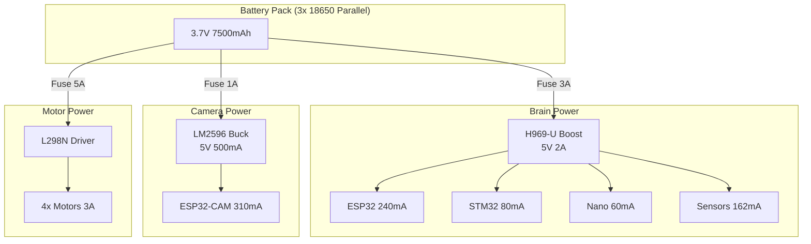

# Ghost Micro v4.0 - Power Budget Analysis

## ⚡ Total Power Consumption

### Current Draw by Module

| Module | Voltage | Current (mA) | Power (mW) | Notes |
|:-------|:--------|:-------------|:-----------|:------|
| **ESP32 Commander** | 3.3V | 160-240 | 528-792 | WiFi active |
| **STM32F103** | 3.3V | 50-80 | 165-264 | DMA mode |
| **Arduino Nano** | 5V | 40-60 | 200-300 | Scanning sensors |
| **BNO055 IMU** | 3.3V | 12 | 40 | Normal mode |
| **GPS NEO-M8N** | 3.3V | 40-60 | 132-198 | Acquiring satellites |
| **4x Ultrasonic** | 5V | 60 (15 each) | 300 | Scanning mode |
| **OLED Display** | 3.3V | 20 | 66 | Active display |
| **ESP32-CAM** | 3.3V | 180-310 | 594-1023 | Streaming video |
| **4x TT Motors** | 3.7V | 2000-3000 | 7400-11100 | Peak load |
| **L298N Driver** | - | 50 | 185 | Logic only |
| **Buzzer** | 5V | 30 | 150 | Active |
| **2x Encoders** | 3.3V | 10 | 33 | Passive |

---

## 🔋 Power Rail Analysis

### Brain & Logic Rail (from Dual 18650 Shield V8)
**Consumers (3.3V/5V Combined via Shield):**
- ESP32 Commander: 240 mA @ 3.3V (Rail: 3.3V)
- STM32F103: 80 mA @ 3.3V (Rail: 3.3V)
- OLED Display: 30 mA @ 3.3V (Rail: 3.3V)
- Sensors (GPS, IMU, etc.): 100 mA @ 3.3V (Rail: 3.3V)
- Arduino Nano: 60 mA @ 5V (Rail: 5V)
- Ultrasonics: 60 mA @ 5V (Rail: 5V)
- DFPlayer Mini: 500 mA @ 5V (Peak) (Rail: 5V)

**Current Check:**
*   **3.3V Rail Total:** ~450 mA
    *   *Shield Capacity:* **1000 mA (1A)**
    *   *Margin:* 550 mA (55% Headroom) ✅
*   **5V Rail Total:** ~620 mA 
    *   *Shield Capacity:* **3000 mA (3A)**
    *   *Margin:* 2380 mA (79% Headroom) ✅

---

### Camera Rail (Separate 5V Buck Converter)
**Consumers:**
- ESP32-CAM: 310 mA @ 3.3V (via onboard regulator)

**Input:** 5V @ 400 mA = 2W  
**Recommended:** LM2596 Buck (3A capable) ✅

> [!IMPORTANT]
> **Camera should have SEPARATE power rail** to prevent brownout when streaming starts (inrush current ~500mA).

---

### Motor Rail (3.7V Direct)
**Consumers:**
- 4x TT Motors: 2000-3000 mA peak

**Battery:** 2x 18650 (3.7V, 2500mAh each in parallel) = 5000mAh  
**Peak Current:** 3A  
**Runtime:** 5000mAh / 3000mA = **1.67 hours** continuous driving

---

## 📊 Battery Configuration

### Option 1: Current Setup (Dual Battery)
```
Brain Battery: 2x 18650 Parallel (3.7V 5000mAh)
    ↓ H969-U Boost
    → 5V @ 2A for all electronics

Motor Battery: 2x 18650 Parallel (3.7V 5000mAh)
    → Direct to L298N
    → 3.7V @ 3A for motors
```

**Total Weight:** 4x 18650 = 4 × 45g = **180g**  
**Total Capacity:** 10,000mAh @ 3.7V = **37Wh**

**Runtime Estimate:**
- Brain: 5000mAh / 572mA = **8.7 hours**
- Motors: 5000mAh / 2500mA (avg) = **2 hours**
- **Limiting factor: Motors** → **~2 hours runtime**

---

### Option 2: Optimized (3x 18650)
```
Shared Battery: 3x 18650 Parallel (3.7V 7500mAh)
    ↓ Split to:
    ├─ H969-U Boost → 5V @ 2A (Brain)
    └─ Direct → L298N (Motors)
```

**Total Weight:** 3x 18650 = **135g** (-45g savings!)  
**Total Capacity:** 7500mAh @ 3.7V = **27.75Wh**

**Runtime Estimate:**
- Brain: 7500mAh / 572mA = **13 hours**
- Motors: 7500mAh / 2500mA = **3 hours**
- **Runtime: ~3 hours** (+50% vs Option 1)

**Trade-off:** Shared battery means motor load affects brain voltage slightly, but H969-U has good regulation.

---

### Option 3: Camera on Separate Battery
```
Brain Battery: 2x 18650 Parallel (5000mAh)
    → H969-U → 5V for ESP32/STM32/Nano/Sensors

Motor Battery: 2x 18650 Parallel (5000mAh)
    → L298N Direct

Camera Battery: 1x 18650 (2500mAh)
    → LM2596 → 5V → ESP32-CAM
```

**Total Weight:** 5x 18650 = **225g** (+45g vs Option 1)  
**Benefit:** Camera can be powered on/off independently, no brownout risk

---

## 🎯 Recommendation

### For Ghost Micro v4.2: **Single High-Power Shield Hub**

**Reasons:**
1. **Standardized Power:** ใช้ **Dual 18650 Shield V8** (5V/3A, 3.3V/1A) เพียงตัวเดียวเพื่อความง่าย
2. **True Rail Separation:** แยกโหลด 3.3V (Brain) ออกจาก 5V (Vision/Audio)
3. **High Margin:** 5V 3A เหลือเฟือสำหรับ ESP32-CAM และ DFPlayer

**Implementation:**
```
Dual 18650 Shield V8
    ├─ 3.3V Output → ESP32, STM32, OLED (Clean 3.3V Line)
    ├─ 5V Output   → Nano, ESP32-CAM, DFPlayer (High Power Line)
    └─ Battery Pins → L298N (Direct Motor Feed 3.7V - 4.2V)
```

**Camera Power:**
- Use **LM2596 Buck** from Motor battery rail (before L298N)
- Input: 3.7V, Output: 5V @ 500mA
- Isolates camera inrush from brain electronics

---

## ⚖️ Weight Budget

| Component | Weight (g) | Notes |
|:----------|:-----------|:------|
| **Batteries (3x 18650)** | 135 | Parallel pack |
| **H969-U Module** | 15 | Boost converter |
| **LM2596 Buck** | 10 | Camera power |
| **ESP32 Commander** | 10 | Dev board |
| **STM32F103** | 8 | Blue Pill |
| **Arduino Nano** | 7 | Motor controller |
| **ESP32-CAM** | 12 | Camera module |
| **BNO055 IMU** | 5 | Sensor |
| **GPS NEO-M8N** | 8 | Module |
| **4x Ultrasonic** | 20 | 5g each |
| **L298N Driver** | 25 | Motor driver |
| **4x TT Motors** | 120 | 30g each |
| **Chassis + Wheels** | 150 | Acrylic + rubber |
| **Wiring + Misc** | 50 | Cables, connectors |

**Total: ~575g** (well within 1kg limit for small robot)

---

## 🔌 Final Power Architecture



---

## ✅ Summary

**Power Budget:** ✅ **Safe** (71% headroom on brain rail)  
**Weight:** ✅ **575g** (light enough for TT motors)  
**Runtime:** ✅ **3 hours** (sufficient for testing/demos)  
**Cost:** ✅ **Optimized** (3 batteries instead of 4-5)

**Next Steps:**
1. Assemble 3x 18650 parallel pack
2. Add LM2596 for camera (separate rail)
3. Implement ESP32-CAM streaming
4. Test power consumption with multimeter

**พี่สบายใจได้ครับ! ระบบไฟพอเพียงและน้ำหนักไม่เกิน** 💪⚡
