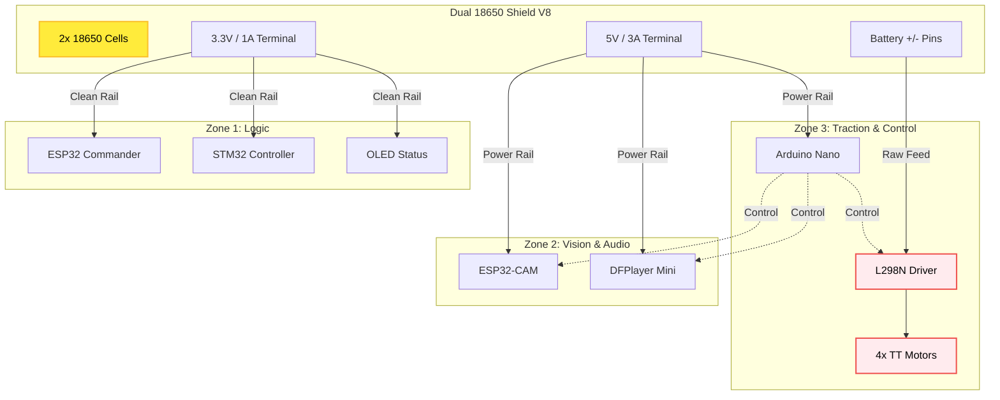
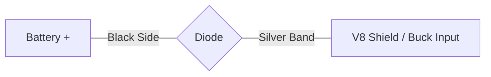

# Ghost Micro v4.0 - Power Circuit Diagram ⚡

## 🔋 Overview (Inventory Optimized)
เพื่อให้หุ่นยนต์เสถียรที่สุดโดยใช้ของที่มีในคลังแสง (**Dual 18650 Shield V8 จำนวน 2 ชุด**):
1.  **Shield ชุดที่ 1 (Brain Zone):** ใส่ถ่าน 2 ก้อน จ่ายไฟให้ ESP32, STM32 และเซนเซอร์หลัก
2.  **Shield ชุดที่ 2 (Power Zone):** ใส่ถ่านอีก 2 ก้อน จ่ายไฟให้ L298N (มอเตอร์) และ ESP32-CAM (กล้อง)
*วิธีนี้จะทำให้ "ไฟกระชาก" จากมอเตอร์ไม่สามารถวิ่งไปกวนสมองกลได้ 100% ครับ*
---

## 🔌 Master Wiring Diagram (Shield V8 Optimized)

## 🛠️ Step-by-Step Wiring (V8 Standard)

### 1. The Power Hub (Shield V8)
*   **Battery:** ใส่ถ่าน 18650 จำนวน 2 ก้อนลงในช่อง (เช็คขั้วให้ถูกตามศรชี้)
*   **Master Logic:** ใช้ปุ่มสวิตช์บน Shield เพื่อเปิด/ปิดระบบไฟทั้งหมด

### 2. Zone 1: Clean Logic (3.3V)
*   ต่อจากช่อง **3.3V** บน Shield ไปที่ขา **3.3V** ของ ESP32, STM32 และ OLED
*   *ไม่ต้องใส่ไดโอด* เพื่อให้บอร์ดได้รับไฟ 3.3V เต็มประสิทธิภาพ

### 3. Zone 2: High Power (5V)
*   ต่อจากช่อง **5V** บน Shield ไปที่ขา **5V** ของ ESP32-CAM, Nano และ DFPlayer
*   **ควบคุม:** ต่อขา Output จาก Nano ไปสั่งงาน MOSFET/Relay เพื่อเปิด-ปิดไฟเลี้ยงของ ESP32-CAM และต่อ Serial ไปสั่งงาน DFPlayer

### 4. Zone 3: Traction (Raw Battery)
*   ต่อสายไฟจากจุด **Battery (+) และ (-)** ที่บอร์ด Shield วิ่งตรงเข้าช่อง **12V/GND** ของ L298N
*   **ควบคุม:** รับคำสั่งความเร็ว (PWM) จาก **Arduino Nano**
*   *แนะนำ:* ขนานคาปาซิเตอร์ 1000uF ที่ทางเข้า L298N เพื่อกรองสัญญาณรบกวนจังหวะมอเตอร์ออกตัว

### 4. Zone 3: Motor Power (L298N)
Motors take raw battery power.
*   **Power:** Connect Battery `+` to L298N `12V` input (it accepts 3.7V-35V).
*   **Ground:** Connect Battery `-` to L298N `GND`.
*   **Note:** **REMOVE** the 5V regulator jumper on L298N if supplying < 7V (keep it on for 3.7V operation usually, but do NOT use the 5V output of L298N to power other things).

---

## ⚠️ Important Safety Checks
1.  **Common Ground:** ensure the negative (`-`) terminal of the battery connects to the GND of **ALL** modules (H969, LM2596, L298N, ESP32, etc.).
2.  **Wire Thickness:** Use thicker wires (20-18 AWG) for the **Battery -> L298N** path, as motors draw high current.
3.  **Voltage Check:** Use a multimeter to verify 5V and 3.3V outputs on the Battery Shield before connecting expensive microcontrollers.
4.  **Capacitor Buffer (Lowers Brownouts):** หากมอเตอร์ออกตัวแล้วกล้องดับ หรือ ESP32 รีบูต ให้ขนานคาปาซิเตอร์ (Electrolytic Capacitor) เข้าที่ขั้วไฟเข้า:
    *   **Motor Rail:** 1000uF 25V (ช่วยกรองสัญญาณรบกวนจากมอเตอร์และลดไฟกระชาก)
    *   **ESP32-CAM (5V/GND):** 470uF 10V (ช่วยสำรองไฟชั่วขณะเมื่อไฟตกตอนมอเตอร์ออกตัว)

---

## ️ Reverse Polarity Protection (Diode)
หากต้องการต่อไดโอดป้องกันไฟย้อนกลับระหว่างทางเชื่อมต่อ:
*   **เบอร์ที่แนะนำ:** **1N4001** (มีในคลังแสง) สำหรับกระแสไม่เกิน 1A หรือ **1N5408** (3A) สำหรับไฟหลัก
*   **การหันขั้ว:** 
    *   **แถบสีเงิน (Cathode):** หันออกไปทาง **อุปกรณ์ (Load)**
    *   **ฝั่งสีดำ (Anode):** ต่อกับ **ขั้วบวกของแบตเตอรี่ (+)**
    *   **Current Flow:** Battery (+) → [Anode] Diode [Cathode (Silver Band)] → System (+)

> [!CAUTION]
> **ห้ามต่อไดโอดหลังออกจาก Shield/Buck:**
> ห้ามนำไดโอไปต่อแทรกระหว่าง "ขาออกของ Shield (3.3V/5V)" กับ "ขาเข้าของบอร์ด ESP32/STM32" โดยเด็ดขาด เพราะแรงดันจะดรอปลง 0.7V ทำให้บอร์ดทำงานไม่ได้หรือรวนครับ (โดยเฉพาะสาย 3.3V จะเหลือแค่ 2.6V ซึ่งไม่พอเปิดเครื่อง)

---

## �📝 Part List
| Component | Function | Status |
| :--- | :--- | :--- |
| **3x 18650 Batteries** | Main Power Source | ✅ Ready |
| **Battery Holder (3-slot)** | Holds batteries in parallel | ✅ Ready |
| **Dual 18650 Shield V8** | 5V 3A / 3.3V 1A Hub | ✅ Ready |
| **LM2596 (Blue Board)** | 5V Buck for Camera | 🛒 Need |
| **SPST Switch** | Master ON/OFF | ✅ Ready |
| **Wires (Red/Black)** | Power distribution | ✅ Ready |
