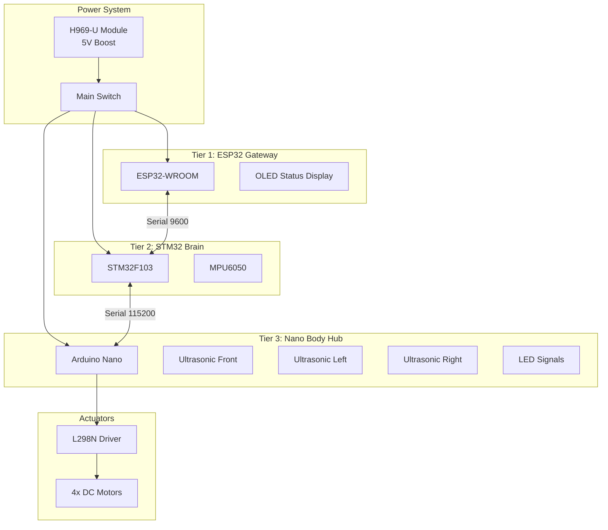

# Ghost Micro v4.5 - Complete Wiring Guide

## 🎯 System Architecture

**3-Tier Hierarchical Control (V4.5):**
- **Tier 1 (Gateway):** ESP32 Gateway (WiFi / WebSocket)
- **Tier 2 (Brain):** STM32 Controller (Navigation Logic)
- **Tier 3 (Body):** Nano Driver (Actuators & Sensors)

---

## 📐 Complete System Diagram

---

## 🔌 Tier 1: ESP32 Gateway Wiring

| Module | Interface | ESP32 Pins | Notes |
|:-------|:----------|:-----------|:------|
| **Link to STM32** | Serial1 | GPIO34 (RX), GPIO27 (TX) | **CRITICAL:** Safe for Flash |
| **OLED Display** | I2C | GPIO21 (SDA), GPIO22 (SCL) | shared bus |
| **Power** | 5V | VIN, GND | From H969 |

---

## ⚙️ Tier 2: STM32 Brain Wiring

| Module | Interface | STM32 Pins | Notes |
|:-------|:----------|:-----------|:------|
| **Link to ESP32** | USART3 | PB10 (TX), PB11 (RX) | @ 9600 Baud |
| **Link to Nano** | USART2 | PA2 (TX), PA3 (RX) | @ 115200 Baud |
| **MPU6050 IMU** | I2C1 | PB6 (SCL), PB7 (SDA) | Body AHRS |
| **Buzzer** | PWM | PB0 | |

---

## 📡 Tier 3: Nano Body Driver Wiring

| Module | Interface | Nano Pins | Notes |
|:-------|:----------|:----------|:------|
| **Ultrasonic F** | Trig/Echo | D2, D3 | |
| **Ultrasonic L** | Trig/Echo | D4, D11 | |
| **Ultrasonic R** | Trig/Echo | D12, A5 | |
| **Signals L/R** | Digital | A0, A1 | Indicators |
| **Headlight** | Digital | A3 | White LED |
| **L298 Control** | PWM/Dig | D5-D10 | 4 Motors |

---

## 📊 Communication Summary (V4.5)

| Link | From | To | Baud | Format |
|:-----|:-----|:---|:-----|:-------|
| **Telemetry** | STM32 | ESP32 | 9600 | Telemetry struct (0xBB 0xCC) |
| **Commands** | ESP32 | STM32 | 9600 | Payload struct (0xAA) |
| **Actuation** | STM32 | Nano | 115200 | Pulse packet (0xFF) |
| **Obstacles** | Nano | STM32 | 115200 | ObstacleMap (0xCC) |

---

## ✅ Assembly Checklist

- [x] Solder ESP32 Safe Pins (34, 27)
- [x] Wire STM32-ESP32 @ 9600
- [x] Install MPU6050 on STM32
- [x] Route 4x Ultrasonic to Nano
- [x] Shift Signals to A0/A1
- [x] Setup Dashboard WebSocket Link
