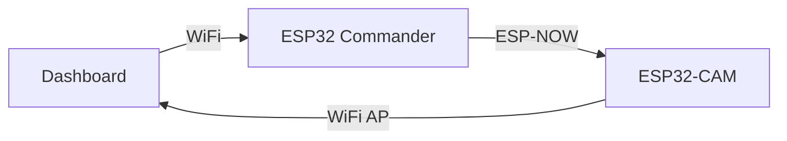
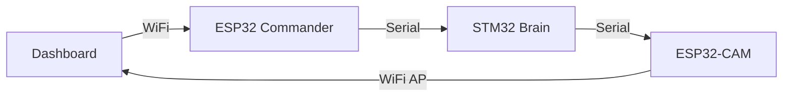

# Camera Control Architecture Comparison

## 🔀 Option A: Direct ESP32 → ESP32-CAM (Recommended ✅)



**Advantages:**
- ✅ **Simpler:** No STM32 involvement
- ✅ **Faster:** Direct communication (~10ms)
- ✅ **Less Wiring:** No extra Serial cables
- ✅ **Independent:** Camera doesn't affect motor control

**How it works:**
1. Dashboard sends "Open Camera" to ESP32 Commander (WiFi)
2. ESP32 Commander sends ESP-NOW packet to ESP32-CAM
3. ESP32-CAM starts WiFi AP + Streaming
4. Dashboard connects to camera WiFi and displays video

**Power:**
- Standby: 80mA (ESP-NOW listening)
- Active: 310mA (WiFi AP + Streaming)
- **Savings: 230mA when idle**

---

## 🔀 Option B: Via STM32 (Unnecessary ❌)



**Disadvantages:**
- ❌ **Complex:** Extra Serial wiring (ESP32→STM32→CAM)
- ❌ **Slower:** 3 hops (~30ms latency)
- ❌ **More Pins:** Uses STM32 UART (needed for Nano)
- ❌ **Coupling:** Camera tied to motor control system

**Why would you do this?**
- Only if STM32 needs to control camera (e.g., auto-capture on obstacle detection)
- Not needed for manual dashboard control

---

## 🎯 Recommended: Direct ESP-NOW Control

### Architecture
```
Dashboard (PC)
    ↓ WiFi
ESP32 Commander (Brain)
    ↓ ESP-NOW (2.4GHz, <1ms)
ESP32-CAM
    ↓ WiFi AP
Dashboard (PC) - Video Stream
```

### Communication Flow

**1. Camera Standby (Default)**
```cpp
// ESP32-CAM firmware
void setup() {
    esp_now_init();  // Listen for commands
    // WiFi AP OFF (save power)
}

void onESPNowReceive(uint8_t *data) {
    if (data[0] == CMD_START_CAMERA) {
        startWiFiAP();
        startStreaming();
    }
}
```

**2. Dashboard Requests Camera**
```python
# Dashboard sends to ESP32 Commander
send_command("CAMERA_ON")
```

**3. ESP32 Commander Forwards**
```cpp
// ESP32 Commander
if (dashboard_cmd == "CAMERA_ON") {
    uint8_t cmd = CMD_START_CAMERA;
    esp_now_send(camera_mac, &cmd, 1);
}
```

**4. ESP32-CAM Activates**
```cpp
// ESP32-CAM receives ESP-NOW
WiFi.softAP("GhostMicro");  // Start AP
startCameraServer();         // Start streaming
```

---

## 📊 Comparison Table

| Aspect | Direct (ESP32→CAM) | Via STM32 |
|:-------|:-------------------|:----------|
| **Latency** | 10ms | 30ms |
| **Wiring** | None (wireless) | 2x Serial cables |
| **Complexity** | Low | High |
| **STM32 Load** | 0% | +5% CPU |
| **Power** | Same | Same |
| **Reliability** | High | Medium (more failure points) |

---

## 🔋 Power Consumption Breakdown

### ESP32-CAM States

| State | WiFi | Camera | Current | Power |
|:------|:-----|:-------|:--------|:------|
| **Deep Sleep** | OFF | OFF | 10mA | 33mW |
| **Standby (ESP-NOW)** | Listen | OFF | 80mA | 264mW |
| **Streaming** | AP | ON | 310mA | 1023mW |

### Recommended Strategy
```
Default: Standby (80mA)
    ↓ Dashboard request
Active: Streaming (310mA)
    ↓ 5 min timeout or manual stop
Back to: Standby (80mA)
```

**Average Power (assuming 10% camera usage):**
- Standby 90%: 80mA × 0.9 = 72mA
- Streaming 10%: 310mA × 0.1 = 31mA
- **Total: 103mA average** (vs 310mA always-on)

**Battery Life Impact:**
- 2500mAh battery / 103mA = **24 hours** (vs 8 hours always-on)
- **3x longer runtime!** 🚀

---

## ✅ Final Recommendation

**Use Direct ESP-NOW Control:**
1. ESP32 Commander sends ESP-NOW to ESP32-CAM
2. No STM32 involvement
3. Camera stays in standby (80mA) until needed
4. Auto-timeout after 5 minutes of inactivity

**Benefits:**
- Simple architecture
- Low latency
- 3x battery life improvement
- No extra wiring

**ไม่ต้องผ่าน STM32 ครับ ให้ ESP32 สั่งตรงเลยดีกว่า!** 💪⚡
