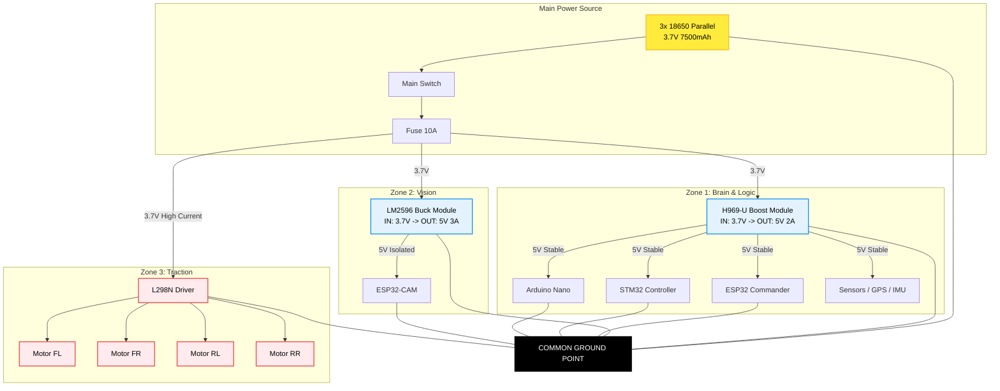

# Ghost Micro v4.0 - Power Circuit Diagram ⚡

## 🔋 Overview
This guide details the **Power Distribution System** for Ghost Micro v4.0.
We use a **3x 18650 Parallel Pack** to power 3 separate zones:
1.  **Brain Zone (5V):** ESP32, STM32, Nano, Sensors (Critical)
2.  **Camera Zone (5V):** ESP32-CAM (Isolated to prevent brownout)
3.  **Motor Zone (3.7V):** L298N + TT Motors (High current)

---

## 🔌 Master Wiring Diagram

---

## 🛠️ Step-by-Step Wiring

### 1. Battery Pack Assembly
*   **Components:** 3x 18650 Li-ion cells (3.7V each).
*   **Configuration:** **Parallel (+ to +, - to -)**.
*   **Output:** 3.7V - 4.2V, ~7500mAh.
*   **Safety:** Add a **Master Switch** and **10A Fuse** on the positive (`+`) line immediately after the battery holder.

### 2. Zone 1: Brain Power (H969-U)
This rail powers the intelligent components. It must be stable 5V.
*   **Input:** Connect Battery `+` to H969-U `IN+`, Battery `-` to H969-U `IN-`.
*   **Output:** Connect H969-U `OUT+` (5V) to the `5V` pins of ESP32, STM32, Nano.
*   **Ground:** Connect H969-U `OUT-` to the `GND` pins of all MCUs.

### 3. Zone 2: Camera Power (LM2596)
**CRITICAL:** The camera is isolated to prevent it from crashing the brain or brownout.
*   **Input:** Connect Battery `+` to LM2596 `IN+`, Battery `-` to LM2596 `IN-`.
*   **Adjust:** **IMPORTANT:** Rotate the trimmer screw on LM2596 until output is exactly 5V BEFORE connecting the camera!
*   **Output:** Connect LM2596 `OUT+` to ESP32-CAM `5V` pin.
*   **Ground:** Connect LM2596 `OUT-` to ESP32-CAM `GND`.

### 4. Zone 3: Motor Power (L298N)
Motors take raw battery power.
*   **Power:** Connect Battery `+` to L298N `12V` input (it accepts 3.7V-35V).
*   **Ground:** Connect Battery `-` to L298N `GND`.
*   **Note:** **REMOVE** the 5V regulator jumper on L298N if supplying < 7V (keep it on for 3.7V operation usually, but do NOT use the 5V output of L298N to power other things).

---

## ⚠️ Important Safety Checks
1.  **Common Ground:** ensure the negative (`-`) terminal of the battery connects to the GND of **ALL** modules (H969, LM2596, L298N, ESP32, etc.).
2.  **Wire Thickness:** Use thicker wires (20-18 AWG) for the **Battery -> L298N** path, as motors draw high current.
3.  **Voltage Check:** Use a multimeter to verify 5V outputs on H969 and LM2596 before connecting expensive microcontrollers.

---

## 📝 Part List
| Component | Function | Status |
| :--- | :--- | :--- |
| **3x 18650 Batteries** | Main Power Source | ✅ Ready |
| **Battery Holder (3-slot)** | Holds batteries in parallel | ✅ Ready |
| **H969-U (Green Board)** | 5V Boost for Brain | ✅ Ready |
| **LM2596 (Blue Board)** | 5V Buck/Boost for Camera | 🛒 Need |
| **SPST Switch** | Master ON/OFF | ✅ Ready |
| **Wires (Red/Black)** | Power distribution | ✅ Ready |
