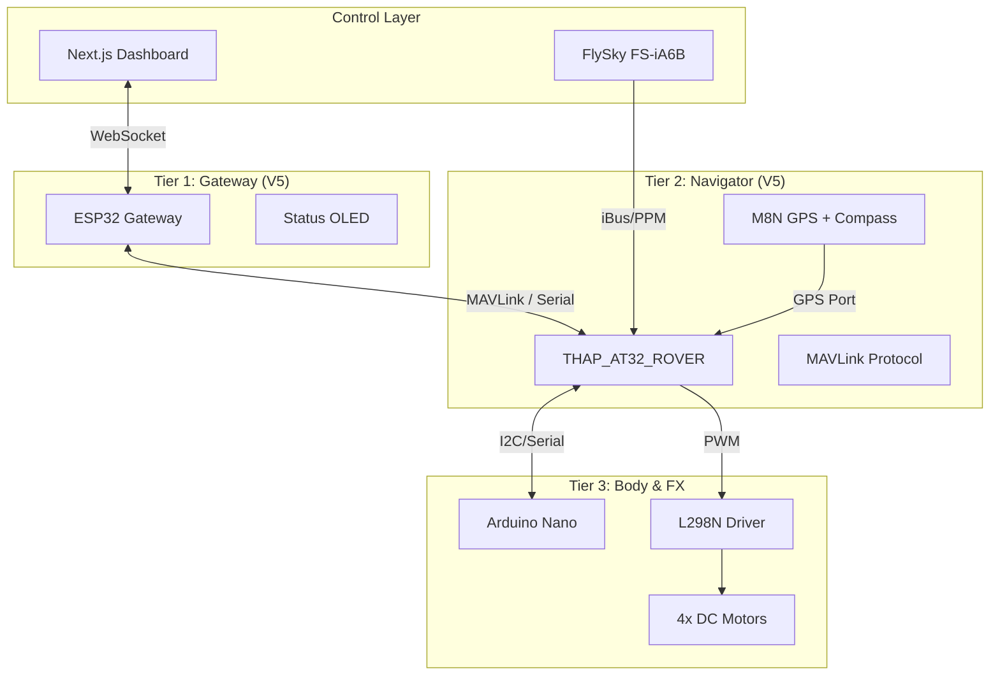

# Ghost Micro V5: Professional Navigator

สถาปัตยกรรมเวอร์ชัน **V5** เปลี่ยนจากการใช้ MCU พื้นฐาน (STM32/Nano) มาเป็น **THAP_AT32_ROVER** (ArduRover Custom Variant) ซึ่งเป็นระบบ Autopilot มาตรฐานไทย เพื่อรองรับฟีเจอร์ระดับมืออาชีพเช่น **Auto-Gimbal, GPS Positioning, และ Autonomous Mission**

---

## 📐 V5 System Map

---

## 🌟 New Capabilities (V5)

### 1. Hybrid Control
- **Manual Mode:** ใช้จอย FlySky บังคับโดยตรงผ่านระบบวิทยุ 2.4GHz (เสถียรที่สุด)
- **C-Link Mode:** ใช้ Dashboard สั่งงานผ่าน WiFi -> ESP32 -> MAVLink (Command Bridge)

### 2. Intelligent Navigation
- **GPS Hold:** รักษามุมและตำแหน่งหุ่นยนต์ให้นิ่งโดยใช้อ้างอิงจากดาวเทียม
- **Compass:** ทิศทางหัวเรือ (Heading) จะไม่หมุนวน (Drift) อีกต่อไปเพราะมีเข็มทิศจริง
- **Mission Planner:** สามารถวางแผนการเดินทางผ่านแผนที่ (Waypoints) ได้ทันที

### 3. Safety Failsafe
- **Battery Monitoring:** Pixhawk จะตรวจจับแรงดันต่ำและแจ้งเตือนทันที
- **Radio Failsafe:** ถ้าสัญญาณวิทยุขาด หุ่นยนต์จะหยุดหรือกลับจุดเริ่มต้นอัตโนมัติ

---

## 🛠 Integration Strategy

1.  **THAP Setup:** ติดตั้ง THAP_AT32_ROVER Firmware (5 Pillars Foundation)
2.  **ESP32 Bridge:** พัฒนาโค้ด ESP32 ให้ทำหน้าที่เป็น **WiFi-to-MAVLink Bridge** (ใช้โปรโตคอล MAVLink 2.0)
3.  **Nano Slave:** ใช้ Nano ทำงานเฉพาะส่วนที่เป็นระบบไฟ (RGB, Signals) และเซนเซอร์ Ultrasonic เพื่อลดภาระของระบบหลัก

---

> [!IMPORTANT]
> **THAP Hardware Warning:** บอร์ด THAP_AT32 มีความอ่อนไหวต่อระดับแรงดันไฟมาก (ต้องการ 5.3V คงที่) แนะนำให้ใช้ **THAP/Pixhawk Power Module** ที่มาในชุดในการจ่ายไฟจากแบตเตอรี่โดยตรง
