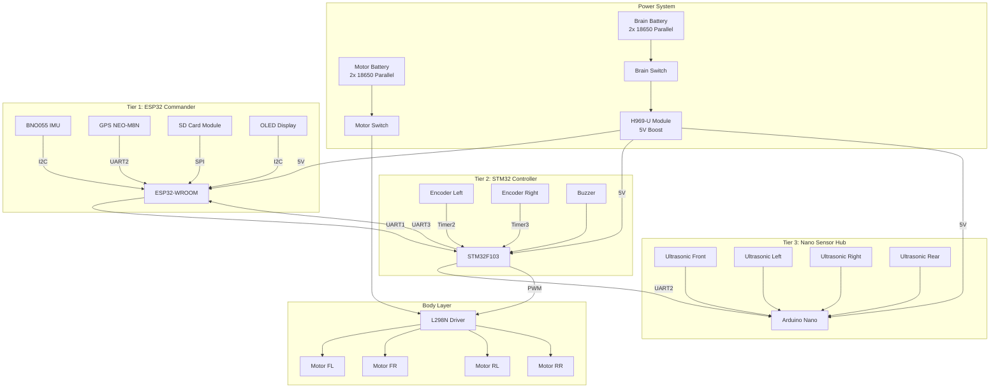

# Ghost Micro v4.0 - Complete Wiring Guide

## 🎯 System Architecture

**3-Tier Hierarchical Control:**
- **Tier 1:** ESP32 (Navigation Brain)
- **Tier 2:** STM32 (Motor Controller)
- **Tier 3:** Nano (Sensor Hub)

---

## 📐 Complete System Diagram



---

## 🔌 Tier 1: ESP32 Commander Wiring

### ESP32 Pin Assignments

| Module | Interface | ESP32 Pins | Notes |
|:-------|:----------|:-----------|:------|
| **BNO055 IMU** | I2C | GPIO21 (SDA), GPIO22 (SCL) | Heading & Tilt |
| **GPS NEO-M8N** | UART2 | GPIO16 (RX), GPIO17 (TX) | Position Data |
| **SD Card** | SPI | GPIO5 (CS), GPIO18 (SCK), GPIO19 (MISO), GPIO23 (MOSI) | Waypoints/Logs |
| **OLED Display** | I2C | Shared with BNO055 | Status Display |
| **STM32 Link** | UART1 | GPIO1 (TX), GPIO3 (RX) | Command/Status |
| **Power** | 5V | VIN, GND | From H969 |

### BNO055 IMU Wiring
```
BNO055          ESP32
VIN     →       3.3V
GND     →       GND
SDA     →       GPIO21
SCL     →       GPIO22
```

### GPS NEO-M8N Wiring
```
GPS             ESP32
VCC     →       3.3V
GND     →       GND
TX      →       GPIO16 (RX2)
RX      →       GPIO17 (TX2)
```

### SD Card Module Wiring
```
SD Card         ESP32
VCC     →       3.3V
GND     →       GND
CS      →       GPIO5
SCK     →       GPIO18
MISO    →       GPIO19
MOSI    →       GPIO23
```

---

## ⚙️ Tier 2: STM32 Controller Wiring

### STM32 Pin Assignments

| Module | Interface | STM32 Pins | Notes |
|:-------|:----------|:-----------|:------|
| **Encoder Left** | Timer2 | PA0 (CH1), PA1 (CH2) | Quadrature |
| **Encoder Right** | Timer3 | PA6 (CH1), PA7 (CH2) | Quadrature |
| **ESP32 Link** | USART3 | PB10 (TX), PB11 (RX) | Receive Goals |
| **Nano Link** | USART2 | PA2 (TX), PA3 (RX) | Motor Commands |
| **Buzzer** | PWM | PB0 | Audio Feedback |
| **LED** | GPIO | PC13 | Status Indicator |
| **Power** | 5V | 5V, GND | From H969 |

### Encoder Wiring (Left)
```
Encoder         STM32
VCC     →       3.3V
GND     →       GND
A       →       PA0 (Timer2 CH1)
B       →       PA1 (Timer2 CH2)
```

### Encoder Wiring (Right)
```
Encoder         STM32
VCC     →       3.3V
GND     →       GND
A       →       PA6 (Timer3 CH1)
B       →       PA7 (Timer3 CH2)
```

---

## 📡 Tier 3: Nano Sensor Hub Wiring

### Nano Pin Assignments

| Module | Interface | Nano Pins | Notes |
|:-------|:----------|:----------|:------|
| **Ultrasonic Front** | Digital | D2 (Trig), D3 (Echo) | 0-400cm |
| **Ultrasonic Left** | Digital | D4 (Trig), D5 (Echo) | Side clearance |
| **Ultrasonic Right** | Digital | D6 (Trig), D7 (Echo) | Side clearance |
| **Ultrasonic Rear** | Digital | D8 (Trig), D9 (Echo) | Reverse safety |
| **STM32 Link** | UART | D0 (RX), D1 (TX) | Report Obstacles |
| **L298N Control** | PWM/Digital | D5-D10 | Motor Driver |
| **Power** | 5V | VIN, GND | From H969 |

### Ultrasonic Sensor Wiring (All 4)
```
HC-SR04         Nano
VCC     →       5V
GND     →       GND
Trig    →       D2/D4/D6/D8 (Front/Left/Right/Rear)
Echo    →       D3/D5/D7/D9 (Front/Left/Right/Rear)
```

> [!WARNING]
> **Pin Conflict:** D5 is used for both Ultrasonic Left Echo AND L298N ENA. We need to reassign!

**Updated Ultrasonic Pins:**
- Front: D10 (Trig), D11 (Echo)
- Left: D12 (Trig), A0 (Echo)
- Right: A1 (Trig), A2 (Echo)
- Rear: A3 (Trig), A4 (Echo)

---

## 🔋 Power Distribution

### Brain Power (H969-U)
```
Battery (+) → Diode 1N5819 → Fuse 3A → Switch → H969 IN+
Battery (-) → H969 IN-
H969 OUT+ → ESP32 VIN, STM32 5V, Nano VIN
H969 OUT- → Common GND
```

### Motor Power (Dedicated)
```
Battery (+) → Diode 1N5819 → Fuse 5A → Switch → L298N VCC
Battery (-) → L298N GND (Common with Brain GND)
```

---

## 📊 Communication Summary

| Link | From | To | Baud | Protocol |
|:-----|:-----|:---|:-----|:---------|
| **Goal Commands** | ESP32 TX | STM32 RX3 | 115200 | GoalCommand |
| **Status Reports** | STM32 TX3 | ESP32 RX | 115200 | StatusReport |
| **Motor Commands** | STM32 TX2 | Nano RX | 115200 | Motor PWM |
| **Obstacle Map** | Nano TX | STM32 RX2 | 115200 | ObstacleMap |
| **GPS Data** | GPS TX | ESP32 RX2 | 9600 | NMEA |

---

## ✅ Assembly Checklist

### Tier 1 (ESP32)
- [ ] Solder BNO055 to I2C (GPIO21/22)
- [ ] Connect GPS to UART2 (GPIO16/17)
- [ ] Wire SD Card to SPI (GPIO5/18/19/23)
- [ ] Test I2C scan (should detect BNO055 at 0x28)

### Tier 2 (STM32)
- [ ] Connect encoders to Timer2/Timer3
- [ ] Wire ESP32 link (USART3)
- [ ] Wire Nano link (USART2)
- [ ] Test encoder pulse counting

### Tier 3 (Nano)
- [ ] Wire 4x ultrasonic sensors
- [ ] Connect STM32 link (UART)
- [ ] Test ultrasonic ranging

### Power
- [ ] Assemble Brain battery (2x 18650 + H969)
- [ ] Assemble Motor battery (2x 18650 + switch)
- [ ] Install fuses and diodes
- [ ] Test voltage rails (5V for brain, 3.7V for motors)

---

## 🚀 Next Steps

1. **Phase 2:** Wire BNO055 + GPS to ESP32
2. **Phase 3:** Wire Encoders to STM32
3. **Phase 4:** Wire Ultrasonics to Nano
4. **Phase 5:** Integration testing

**Status:** Wiring guide complete ✅
